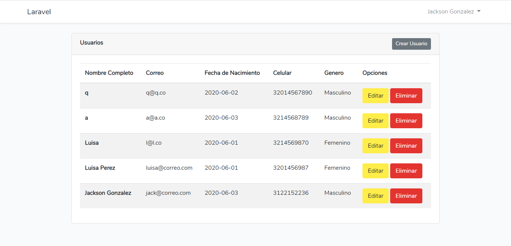

<h1>Prueba N1 Login</h1> 

## Comandos de instalacion
composer install 
npm install 
crear el archivo .env copiando el .env.example 
php artisan key:generate 
php artisan migrate 
php artisan serve 

Prueba N1 Login es una aplicacion para la prueba de discork que permite leer guardar y actualizar registros desde la base de datos y el fronted.